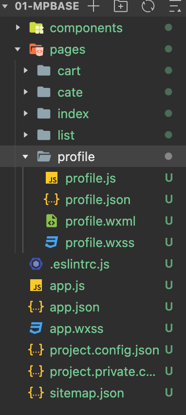
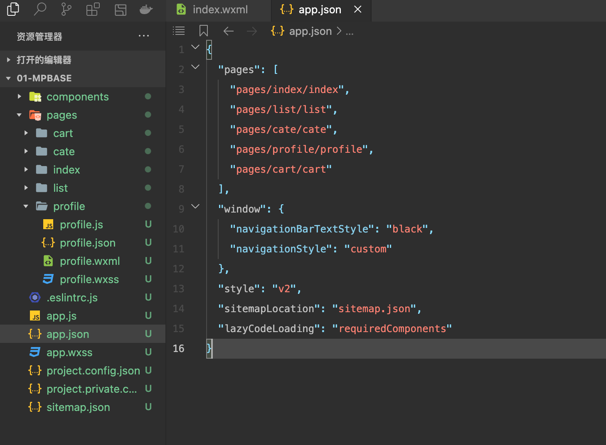
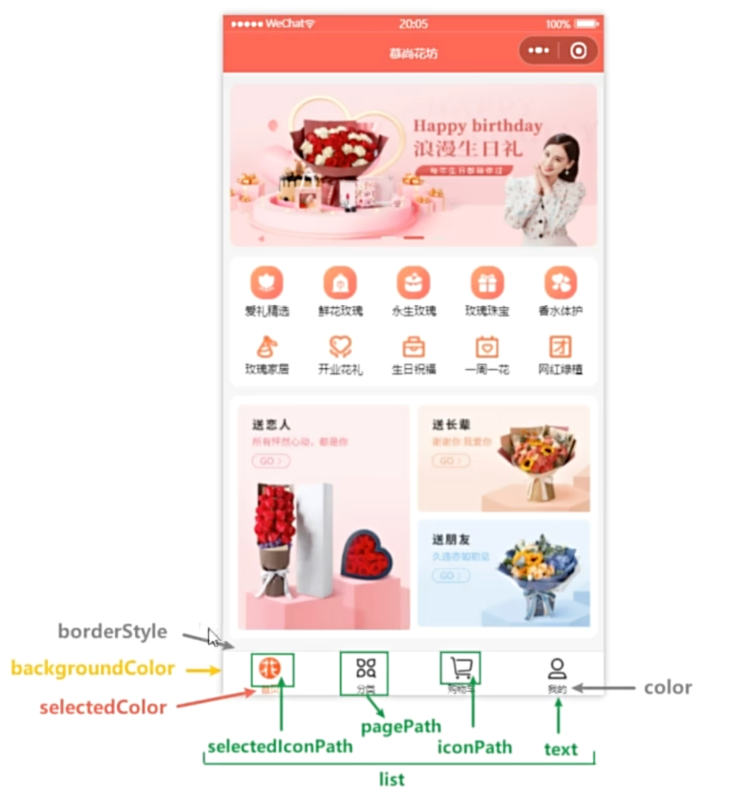
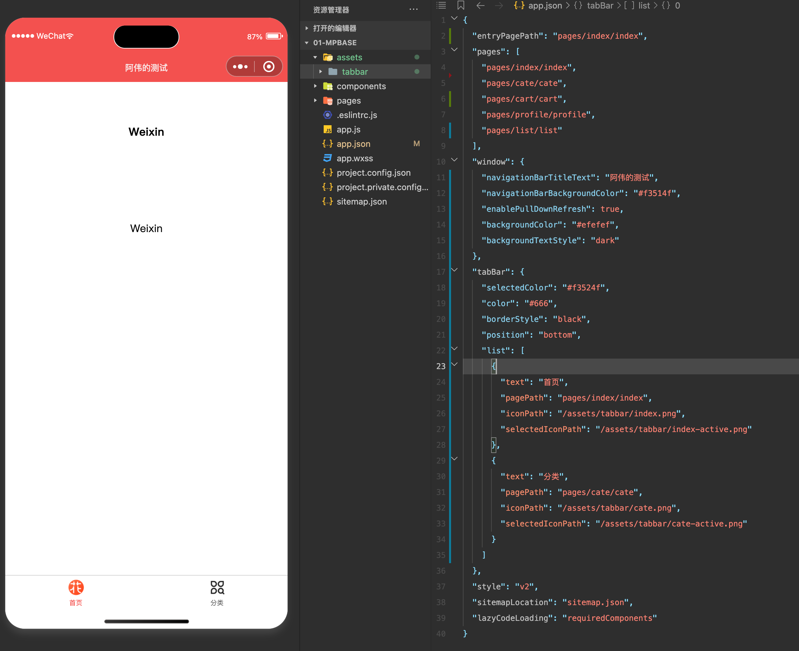
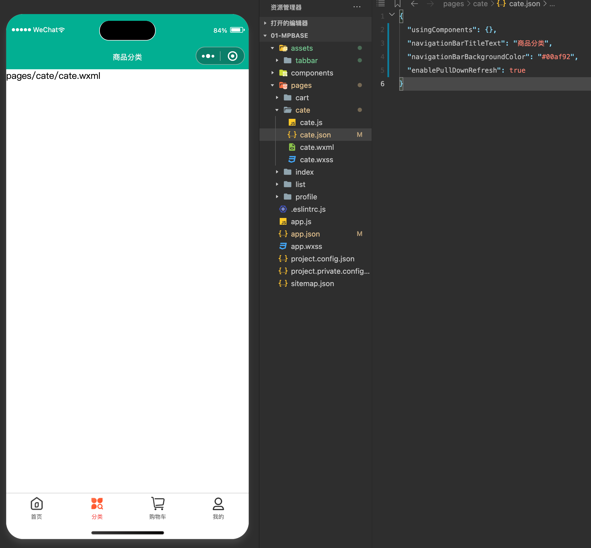
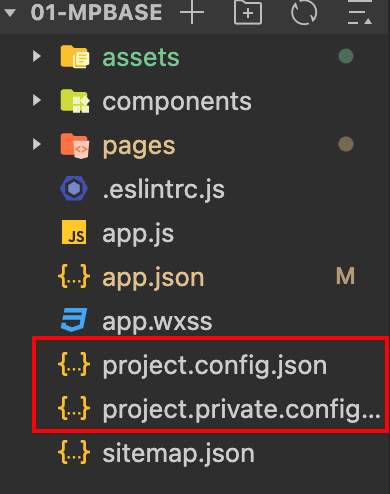
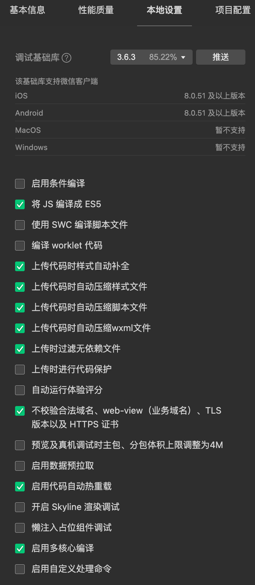
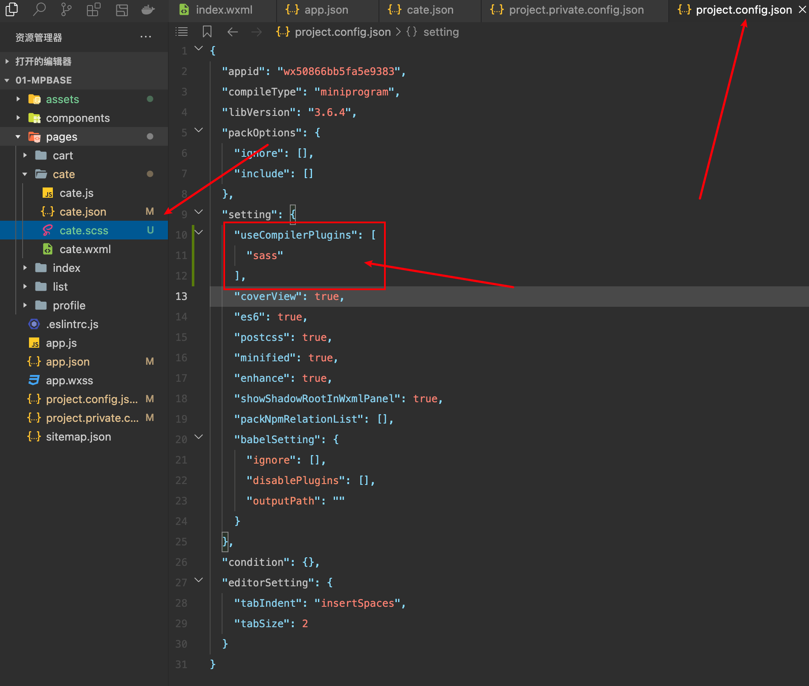

# 配置文件

## 介绍



- app.json

小程序全局配置文件，用于配置小程序的一些全局属性和页面路由

- 页面.json

小程序页面配置文件，也称局部配置文件， 用于配置当前页面的窗口样式、页面标题等

- project.config.json

小程序项目的配置文件，用于保存项目的一些配置信息和开发者个人设置

- sitemap.json

配置小程序及其页面是否允许被微信索引，提高小程序在搜索引擎搜索到的概率

## 全局配置

### pages

用来指定小程序由哪些页面组成，用于让小程序知道由哪些页面组成以及页面定义在哪个目录，每一项都对应一个页面



::: warning 注意点

1. 页面路由不需要写文件后缀，框架会自动去寻找对应位置的四个文件进行处理
2. 小程序新增/减少页面，都需要对 pages 数组进行修改
3. `未指定 entryPagePath 时，数组的第一项代表小程序的初始页面（首页）`
   :::

- 直接指定启动页面

```json
// 可以使用 entryPagePath 指定启动页面，即使 page 的第一个不是 index，启动页面也是 index
{
	"entryPagePath": "pages/index/index",
	"pages": [
		"pages/list/list",
		"pages/index/index",
		"pages/cate/cate",
		"pages/profile/profile",
		"pages/cart/cart"
	],
	"window": {
		"navigationBarTextStyle": "black",
		"navigationStyle": "custom"
	},
	"style": "v2",
	"sitemapLocation": "sitemap.json",
	"lazyCodeLoading": "requiredComponents"
}
```

### window

::: info 地址
[window 官方说明](https://developers.weixin.qq.com/miniprogram/dev/reference/configuration/app.html#window)
:::

window 字段：用于设置小程序的状态栏、导航栏、标题、窗口背景色

> 练习的时候将这些属性都在配置项里面进行尝试
>
> 窗口在下拉刷新的时候才会显示


### tabbar

定义小程序顶部、底部 tab 栏，用以实现页面之间的快速切换

可以通过 tabbar 配置指定 tab 栏的表现，以及 tab 切换时显示的对应页面



::: warning 提示
tab 按数组顺序排序，list 配置最少两个、最多 5 个
:::

- 示例



## 页面配置

[页面配置说明文档 - 官网](https://developers.weixin.qq.com/miniprogram/dev/reference/configuration/page.html)

小程序的页面配置，也称局部配置，每一个小程序页面也可以使用自己的 .json 文件对本页面的窗口表现进行配置

需要注意的是：页面配置文件的属性和全局文件中的 window 属性几乎一致，只不过这里不需要额外指定 window 字段，因此如果出现相同的配置项，页面中配置项 `会覆盖全局配置文件中相同的配置项`



## 项目配置文件和 sass

- 项目配置文件

[官方文档 - 项目配置文件](https://developers.weixin.qq.com/miniprogram/dev/devtools/projectconfig.html)

在创建项目的时候，每个项目的根目录生成两个 config.json 文件，用于保存开发者在工具上做的个性化配置，例如和编译相关的配置

当重新安装微信开发者工具或换电脑工作时，只要载入同一项目的代码包，开发者工具就会自动恢复到开发项目时的个性化配置

项目根目录中的 project.config.json 和 project.private.config.json 文件都可以对项目进行配置



project.config.json：`项目配置文件，常用来进行配置公共的配置`

project.private.config.json：项目私有的配置，常用来配置个人的配置

::: warning 注意

1. project.private.config.json 写到 .gitignore 避免版本管理的冲突
2. 与最终编译结果有关的设置必须设置到 project.config.json 中
   :::

如果影响最终编译，就会将配置放在 project.config.json 中

如： 将 js 编译成 es5

如果只影响开发体验，则会放在 private 里面

如： 不校验合法域名、webview (业务域名)



- sass

在 project.config.json 中，添加 useCompilerPlugins 中添加配置 sass, 然后修改样式代码后缀为 scss



## sitemap.json

配置小程序及其页面是否允许被微信索引，提高小程序在微信内部被用户搜索到的概率

微信现已开放小程序内搜索，开发者可以通用 sitemap.json 配置来设置小程序页面是否允许微信索引。

当开发者允许微信索引时，微信会通过爬虫的形式，为小程序的页面内容建立索引

当用户的搜索词条触发该索引时，小程序的页面将可能展示在搜索结果中

::: warning 注意

1. 没有 sitemap.json 则表示所有页面都能被索引
2. "action": "allow",
   "page": "\*" 是优先级最低的默认规则，未显式指明 `disallow` 的都默认被索引

:::
