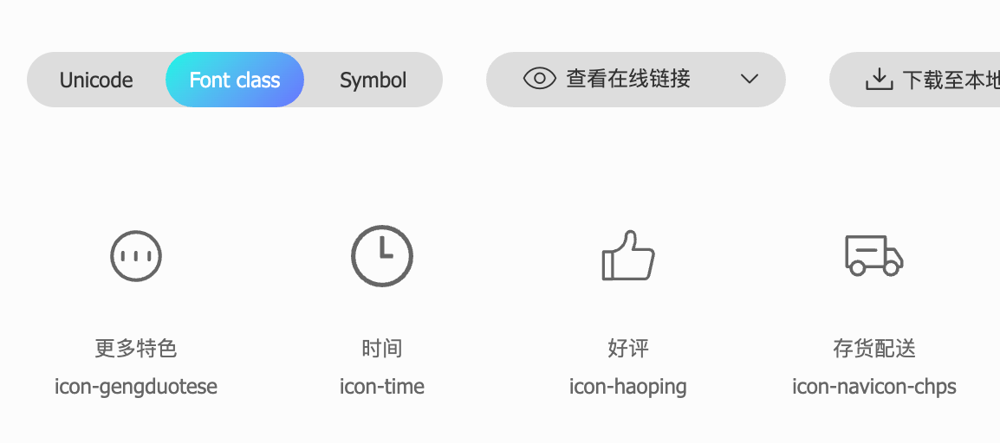
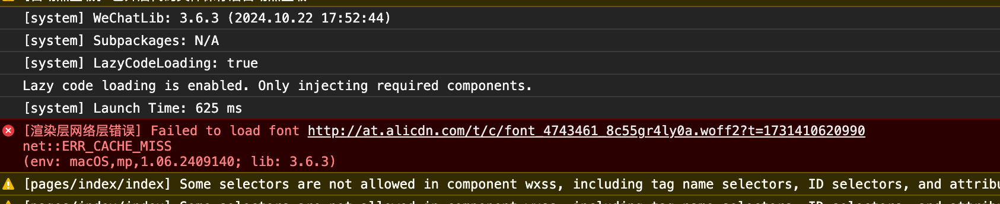
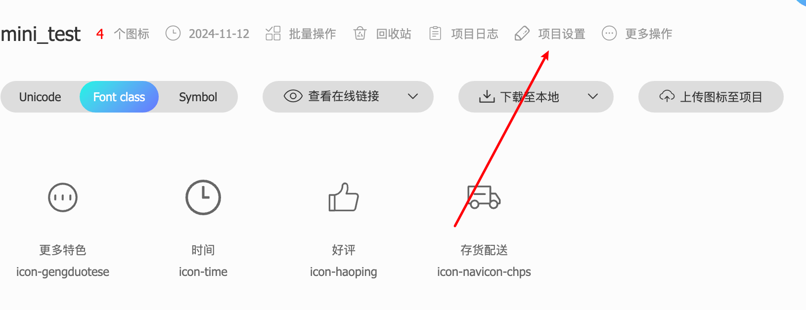

# 组件案例

案例展示

{width=200px}

里面设计到的知识点：

1. prettier 配置： [配置](https://blog.csdn.net/Umbrella_Um/article/details/123634401)
2. view、navigator、text、image、scroll-view...组件的使用: [组件文档](https://blog.csdn.net/Umbrella_Um/article/details/123634401)
3. tabbar 等全局配置: [说明文档](https://developers.weixin.qq.com/miniprogram/dev/reference/configuration/app.html#tabBar)

::: danger 注意
下次复习的时候一定要打开项目，对照着文档复习

不要再第三次重新学习！！！
:::

## 案例知识点

### navigation

常用的属性有两个

- url： 当前小程序内的跳转链接
- open-type：跳转方式
  1. navigate：保留当前页面，跳转到应用内的某个页面，但是不能跳转到 tabbar 页面 `	对应 wx.navigateTo 或 wx.navigateToMiniProgram 的功能`
  2. redirect：关闭当前页面，跳转到应用内的某个页面，但是不能跳转到 tabbar 页面 `	对应 wx.redirectTo 的功能`
  3. switchTab：跳转到 tabBar 页面，并关闭其他所有非 tabbar 页面 `	对应 wx.switchTab 的功能`
  4. reLaunch：关闭所有页面，打开到应用内的某个页面 `	对应 wx.reLaunch 的功能`
  5. navigateBack：关闭当前页面，返回上一页面或多级页面 `	对应 wx.navigateBack 或 wx.navigateBackMiniProgram （基础库 2.24.4 版本支持）的功能`

注意：

1. `路径后面可以带参数`，参数与路径之间使用 ? 分隔，参数键与参数值用 = 相连，不同参数用 & 分隔

   > 例如：/list?id=10&name=chenwei，在 `onLoad(options)生命周期函数`中获取传递的参数

2. open-type='switchTab' 时不支持传参

### iconfont 图标

进入 icon 图标库 [iconfont](https://www.iconfont.cn/)

然后选择相应图标 --> 添加在购物车 --> 在购物车中添加到项目

然后在资源管理/我的项目，找到刚才的项目，然后`查看在线连接`

{width=400px;}

将生成的连接在浏览器中打开，复制里面的内容

然后在项目创建 iconfont/iconfont.[wx|sc]ss 文件,将复制的内容粘贴进去，接着在 app.scss 里面引入，即可在全局使用了

::: details 显示详情

::: code-group

```scss [iconfont.scss]
@font-face {
	font-family: 'iconfont'; /* Project id 4743461 */
	src: url('//at.alicdn.com/t/c/font_4743461_8c55gr4ly0a.woff2?t=1731410620990') format('woff2'), url('//at.alicdn.com/t/c/font_4743461_8c55gr4ly0a.woff?t=1731410620990')
			format('woff'),
		url('//at.alicdn.com/t/c/font_4743461_8c55gr4ly0a.ttf?t=1731410620990') format('truetype');
}

.iconfont {
	font-family: 'iconfont' !important;
	font-size: 16px;
	font-style: normal;
	-webkit-font-smoothing: antialiased;
	-moz-osx-font-smoothing: grayscale;
}

.icon-gengduotese:before {
	content: '\e6a4';
}

.icon-time:before {
	content: '\e60d';
}

.icon-haoping:before {
	content: '\e618';
}

.icon-navicon-chps:before {
	content: '\e64d';
}
```

```scss app.scss
@import './iconfont/iconfont.scss';
```

```html index.wxml
<view class="info">
	<text> <text class="iconfont icon-gengduotese"></text> 同城配送</text>
	<text> <text class="iconfont icon-time"></text> 行业龙头</text>
	<text> <text class="iconfont icon-haoping"></text> 半小时送达</text>
	<text> <text class="iconfont icon-navicon-chps"></text> 100% 好评</text>
</view>
```

:::

但是这样会出现问题：

{width=90%}

- 解决方式：



在项目设置里面勾选上 base64 格式，然后再次生成在线，然后问题就解决了

::: details 查看

```scss
@font-face {
	font-family: 'iconfont'; /* Project id 4743461 */
	src: url('data:application/x-font-woff2;charset=utf-8;base64,d09GMgABAAAAAAVYAAsAAAAAC2gAAAUMAAEAAAAAAAAAAAAAAAAAAAAAAAAAAAAAHFQGYACDMgqJaIg/ATYCJAMUCwwABCAFhGcHVRvuCRFVnP3Jfg64m+Nc3Zoxcq4xipf0kWnL6/WfFkmZZebK5/+98r5kmcxsNeM1WfKlUAqAqfzZMyYud0na/l7umctOo3AW9EuHA4nif+cydyMWLm6EoDCX/lKgfek/0nNjI4CMRGHITaExawCCgLMHx4wXZRtYns0GNLXIpKi25igezmbx2fYN9mBtby+Kf4pXMbqDLktxT94HBACHPYYQT5xa2CBhJ0NNWuQiGyTAkEk6PYcR29VBbZAIbKWRPdUINAvGADOFuQZgpvh68gX+xAxgoFlkd8ptnrTIR5JL61hqoMA+A8WrobszAIwBsAA8j8xA+m/bOiGdxFPIXGizwh0ABxsMRl2lkbKkdQYDg+jcFG7+Dw9gIFAggJggk8kYJjZkBEjykgEMIGkYwAJSFm9bvo4K7ovMuD6FA6AEIYcBxgaZwlFYjCG521Wq5CxHq1R6+xmpXShBbk6WdRwVvRFp4StxavE7SSj5kE6dSikoFalUoL+NqzzcQoiwVdwM0E18IqnD4Nscm4PMtzl22+GIx5RxwwLCCgt5XpwPpvKCzitaeVFy8eFDB5Vwlxeva5WLQX01/PrD27XzFfMUpYsUixzXOVrMqyGgmnkKBf7RCkYuqhcu1VcsJMIC1ZJAGcZaQa3eaaNeqF5KBF1xxy3chk2NcY8dQrwi4uJ1a+odQmTiThzbp3zYBIZu5nl6+rp48yyRk028uJWQhariBRxnoH++mn+96vDGGeHsTfH6aXrqWvHUW/S2eFe40wnI664C98JY6Lzic+FcEbF8cgidZ/jWUNSa5+ub51d0oWA37H54kd+Fxdr68AH1vbUhIbVh9RJnczYfXh8m8XUDHkIGf1AZalIPlOI3YvkfBsMYd7e6wnn6dOcKl+pbBbth9+zx6GqXW8B6k3EHh0B/Q1hYQ0TT94LdLG7obYr4vsjxenrQbItZWkEpdhR2057UzsP/eD73nDvF3s50ZkHVcFC9zty12dUudIy+t2tMVuwfXThJw+lNoxP8enc+eHT1LYv/fY6zTjc+R6oS2q3JqtkLv3abs/dtcspogwnrlvYBLM6zmTiEhQxmc5mD1rYC+VEFLob1zWw6x+K111f2uU6Y6HDAdHeHwCGc0D05P+FQQVuTxcniKTvEzjH7bdrbbMcejtFv0+9Sif0ytzp3RE8Xmz3vh76+US4u2eD0Ljt96Sujfr/TCwe7VLuUHqk9El84QxbHF45LSQocs9Kef87blBrVt5r529qngdx35XduM4YCAAwP2c2sm6DQIMLeP9hDrC8IwL5kHv1mdkPUXMXBmorzPzPvbzT3tvTnDSbU433m5ShI834h8m3JlirmMHlQfcmToGlfnIPhd1Dzk3ClPnGMGUwLsSd8B5ilA2HrEQqzBM1zBMN2AdfK5NmeTCgH5QCYOiBAYrfAQm8QsReEwnyAVvoFI/YPrsfKLueZjo8bYAgWTWSpxwNtF0oUy66Bk5TMrPm2wEQe9dDWppZ5ZBo0GBNHRCmnDdGmtgkUnbLvBlIGNDSBDxybXMSwr7nZhq7cxANFxhmAQcBCJWRrZg8X0OzWOP15a4AjSWKMJGLLYkScy5anWjVpkUBMy7RUwyPJj6Q42iCz2GgpMSysUFOuBcgoGKBC2O8DPLI1cTX8oT7NeStbVta0f4V6gBV4BJtkr6fHJKRIk4F30I6VDBAiyEVPQYHLgtDTTqlmqTuS2MjdMCIE')
			format('woff2'), url('//at.alicdn.com/t/c/font_4743461_aoo66cfgvmk.woff?t=1731412046918')
			format('woff'),
		url('//at.alicdn.com/t/c/font_4743461_aoo66cfgvmk.ttf?t=1731412046918') format('truetype');
}

.iconfont {
	font-family: 'iconfont' !important;
	font-size: 16px;
	font-style: normal;
	-webkit-font-smoothing: antialiased;
	-moz-osx-font-smoothing: grayscale;
}

.icon-gengduotese:before {
	content: '\e6a4';
}

.icon-time:before {
	content: '\e60d';
}

.icon-haoping:before {
	content: '\e618';
}

.icon-navicon-chps:before {
	content: '\e64d';
}
```

:::

### background-image

编写小程序的样式文件时，可以使用 background-image 属性来设置元素的背景图像

::: warning 注意事项

1. 小程序的 background-image 不支持本地路径，需要使用网络图片，或者 base64，或者使用 image 组件
2. 建议使用网络图片
   :::
