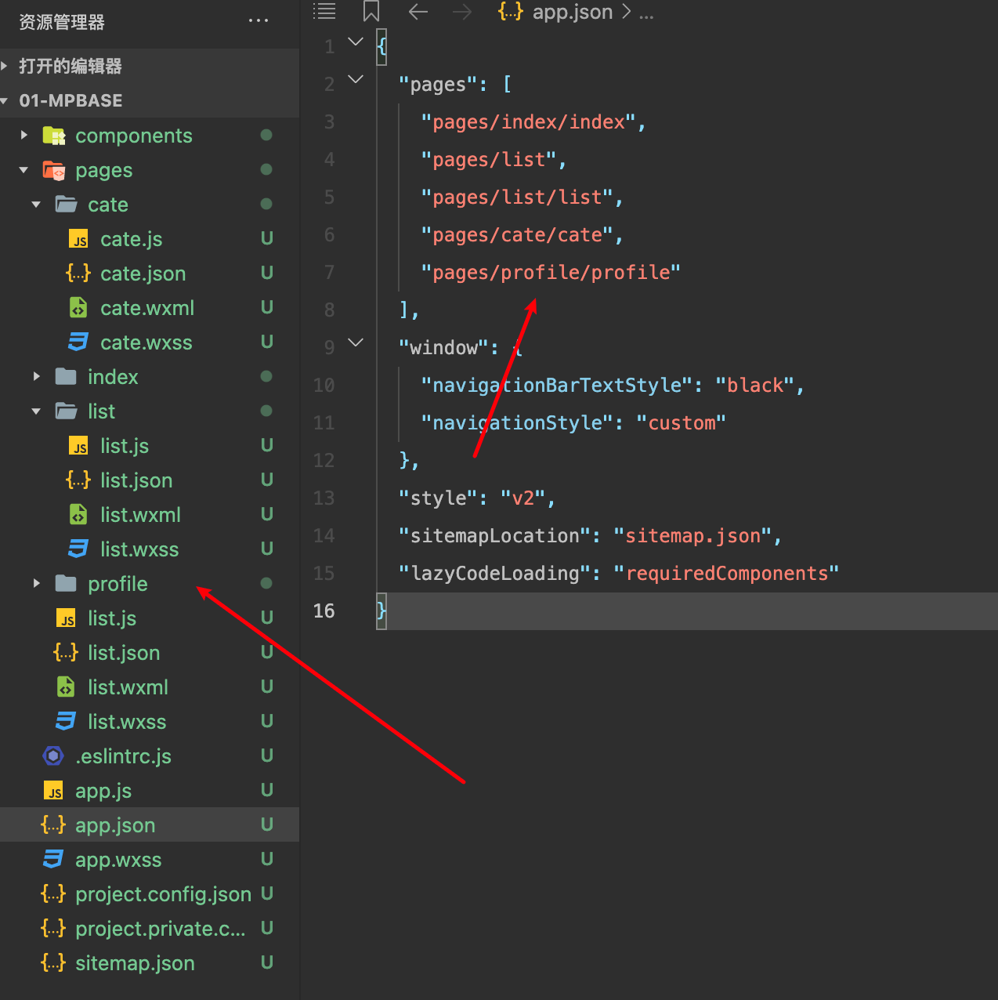

# 基础

## 注册与认证

直接进入： [小程序首页注册](https://mp.weixin.qq.com/wxamp/home/guide?token=129381542&lang=zh_CN)

注册完毕以后进入首页， 完成认证

## 认证

- 小程序信息

按照要求填写即可，没什么特别需要记录的

- 小程序类目

不要选择小游戏类目，否则会被认为是小游戏（如果做游戏就选）

- 更改设置

## 项目成员与体验成员

提供了两种不同的成员角色：项目、体验成员

- 项目成员
  > [详细](https://kf.qq.com/faq/170302zeQryI170302beuEVn.html)

参与小程序开发、运营的成员，包括运营者、开发者及数据分析者，项目成员可登录微信公众后台，管理员可以在成员中添加、删除项目成员，并设置成员的角色

- 体验成员

参与小程序内测试体验的成员，可使用体验版小程序，但不属于项目成员。管理员及项目成员均可添加、删除体验成员

- 添加成员

点击添加

然后在弹出框中选择权限

完事成员就会出现在列表中了

::: info 提示
体验成员添加同理
:::

## 小程序开发者 ID

> 管理 --> 开发管理 --> 开发设置

微信小程序账号只要满足开发资质都可以进行注册，并且会获得对应的开发者 ID

一个完整的开发者 ID `小程序ID (appID)` 和 `小程序密钥 (AppSecret)` 组成

`小程序 ID` 是小程序在整个微信账号体系内唯一身份认证，后续在很多地方都会用到

> 新建小程序项目、真机调试、发布小程序等操作时，必须有小程序 ID

`小程序密钥` 是开发者对小程序拥有所有权的凭证，在进行微信登录、微信支付，或进行发送消息等高级开发时会使用到

## 微信开发者工具

> [下载地址](https://developers.weixin.qq.com/miniprogram/dev/devtools/download.html)

- 稳定版：稳定性高
- 预发布版：稳定性尚可，一般包含新的、大的特性，通过了内部测试
- 开发版：稳定性差，主要用于尽快修复缺陷和敏捷上线小的特性

::: warning 注意
微信开发者工具必须联网使用
:::

## 创建小程序项目

选择一个空目录

## 文件和目录结构

一个完整的小程序分为两个部分：主体文件、页面文件

- 主体文件：

能够作用于整个小程序，影响到小程序的每个页面，主体文件必须放到项目的根目录下

主体文件由三个部分组成：

1. app.js: 小程序入口文件
2. app.json: 小程序的全局配置文件
3. app.wxss: 小程序的全局样式

::: warning 提醒
主体文件的名字必须是 app，app.js 和 app.json 是必须的
:::

- 页面文件

1. .js: 页面逻辑
2. .wxml: 页面结构
3. .wxss: 页面样式
4. .json: 小页面配置

::: warning 提醒
.js 和 .wxml 文件是必须的
:::

- 配置修改

当前 skyline 模式不够成熟，换成 webview

将 app.json 中部分配置删除即可，以下部分删除

## 创建页面

- 创建页面

先新建文件夹

然后在新建的文件夹右键新建 page，输入 list （不要有任何后缀）

- 通过 json 创建页面

json 文件里面直接加上这个地址，保存后就会立即创建了

## 调试基础库

小程序调试基础库是指微信开发者工具中可以选择的微信基础库版本

`微信基础库是指小程序的运行环境，给小程序提供了运行所需的各种 API 和工具，以及基础框架和运行逻辑等`

小程序开发者可以在微信开发者工具中选择所需的微信基础库版本，作为运行和调试小程序时的运行环境

每个小程序有自己所允许使用的基础库最低版本要求，开发者需要选择需要兼容的基础库版本，从而确保小程序的功能正常运行

## 调试小程序代码

